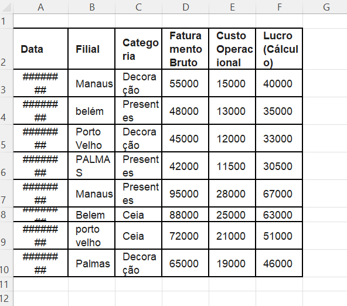

# 🍊 Case Study: Supermercado Tangerina

📝 Sobre o Projeto
Este é um projeto End-to-End de Business Intelligence desenvolvido de forma autônoma para fins acadêmicos. O objetivo foi simular um cenário real de varejo onde o analista recebe dados desestruturados e precisa transformá-los em uma recomendação de investimento para a diretoria.

## 🎨 Branding e Identidade Visual
Diferente de projetos técnicos comuns, este iniciou-se na concepção da marca.
1. Naming: Criação do nome "Supermercado Tangerina".
2. Visual: Desenvolvimento de uma paleta de cores (Laranja e Verde) aplicada em todo o ecossistema do projeto (Excel, BI e PDF) para garantir uma experiência de usuário (UX) coesa e profissional.

## 🔍 Estrutura do Repositório
* 📂 dados_excel/: Contém todas as pastas de trabalho do projeto
* 📂 dashboard/: PowerBi / PowerQuery
* 📂 img/: imagens da estrutura do projeto
* 📂 pdf/: Relatório técnico do projeto inteiro + análise dos dados comerciais
* 📂 csv/: dados em formato csv

## ⚙️ Engenharia de Dados (ETL)
A etapa mais crítica do projeto. Os dados iniciais no Excel apresentavam diversos problemas que impediriam uma análise correta.
1. Utilizei o Power Query para:
2. Tratamento de Sujeira: Correção de erros de digitação e padronização (Ex: Unificação de "belém", "belem" e "BELÉM").
3. Tipagem de Dados: Resolução de erros de data (transformando ###### em datas úteis) e formatação de moedas.
4. Validação (Batimento de Dados): Realizei uma auditoria entre a origem e o destino para garantir 100% de paridade nos valores de faturamento e lucro.

## 📊 Dashboard e Análise de BI
O dashboard foi construído no Power BI focando em três pilares:
1. Visão Executiva: KPIs de Faturamento, Custo e Lucro Total.
2. Sazonalidade: Comparativo entre Novembro e Dezembro (Natal/Réveillon).
3. Eficiência por Unidade: Análise de margem de lucro por cidade.

## 💡 Tecnologias e Ferramentas
1. Excel: Auditoria e armazenamento. 
2. Power Query: ETL e Limpeza. 
3. Power BI: Modelagem, DAX e Visualização. 
4. Canva: Branding e Relatório completo sobbre o projeto + análise.

## 🏆Performance Consolidada (Nov/Dez 2025)
Os indicadores de topo do dashboard resumem a saúde financeira da rede:
1. Total (Lucro): R$ 365,5 Mil
2. Faturamento Bruto: R$ 510 Mil
3. Custos Operacionais: R$ 144,5 Mil
4. Análise de Dashboard e Veredito Estratégico

## 🗺️ Abaixo estão exemplos visuais do processo de limpeza dos dados e do dashboard final desenvolvido no projeto:

### Antes do tratamento de dados

### Depois do tratamento de dados

### Power Query

### Dashboard

